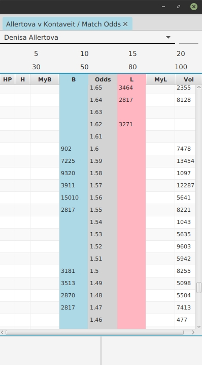
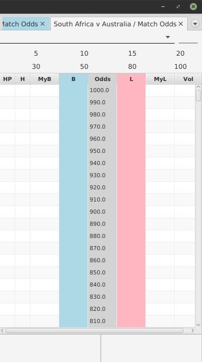

# betfair-trading-app
Fully fledged custom Betfair trading software, written in 2016.

I'm not sure if this still builds, I'm not even sure if this is the version of code I used for production. Anyway, to use this app, you need to edit /src/main/resources/application.conf and provide your betfair api key there.

Below are some old screenshots of the working app.

# Screenshots
## Login window

## Market navigator window

## Adding selection to 'My markets' and setting odds alarm

## Ladder interface with multiple markets opened (one market per tab)

